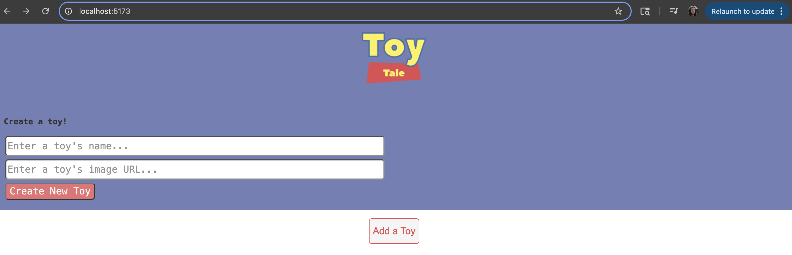
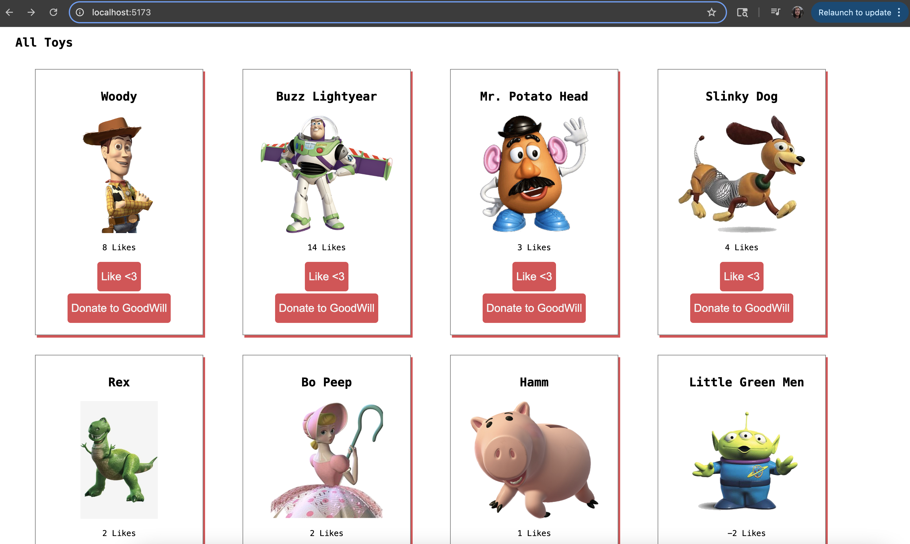
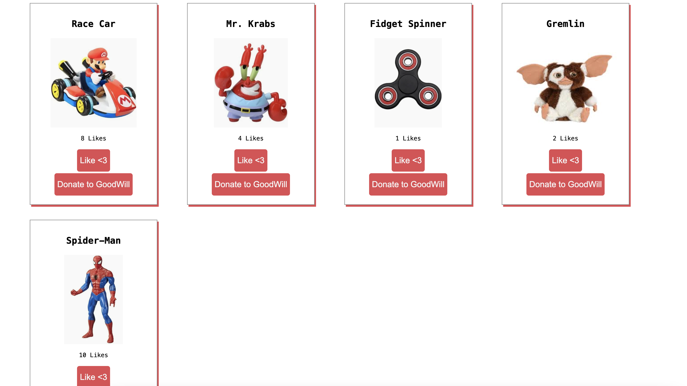

# Toy Tales
This is a simple React CRUD application for managing a list of toys. Users can view all toys, add a new toy, like their favorite toys, and donate (delete) toys they no longer want.

## Features:
- View All Toys: Fetch and display all toys on page load.
- Add New Toy: Submit a form to add a new toy to the database.
- Like a Toy: Click the like button to increase a toy's like count.
- Donate to GoodWill: Remove a toy from the collection by clicking the donate button.

## Installation:
1. Install dependencies via:
    npm install
2. Start the development server via:
    npm run dev
3. Start the backend JSON server via:
  npm run server
The frontend will run on http://localhost:5173/
The backend JSON server will run on http://localhost:3001/toys

## Screenshots:

Thank you and enjoy!

------

# Practice Challenge: Toy Tales

You've got a friend in need! Again!

Andy has misplaced of his toys (again) and need your help to organize them.

## Setup

All the information about Andy's toys can be found in the `db.json` file. We'll
be using `json-server` to create a RESTful API for our database.

Run `npm install` to install our dependencies.

Then, run `npm run server` to start up `json-server` on `http://localhost:3001`.

In another tab, run `npm run dev` to start up our React app at `http://localhost:3000`.

In another tab, run `npm run test` to run the test suite.

Before you start building out the application, the first step that you should
take is to examint the current code and component hierarchy. This will tell you 
how components can pass data to each other as well as where that information should 
be stored.

## Deliverables

- _When our application loads_, make a GET request to `/toys` to fetch the toy
  array. Given your component tree, think about which component should be
  responsible for the array. After you have put the data in the proper
  component, your next job is to render the `ToyCard` components on the page.

- _When the `ToyForm` is submitted_, make a POST request to `/toys` to save a
  new toy to the server. Using the ideas of controlled form and inverse data
  flow, think about how to render a new `ToyCard` for the toy that you created.

- _When the `Donate to Goodwill` button is clicked_, make a DELETE request to
  `/toys/:id` with the ID of the toy that was clicked to delete the toy from the
  server. The `ToyCard` that you clicked on should also be removed from the DOM.

- _When the like button is clicked_, make a PATCH request to `/toys/:id` with
  the id of the toy that was clicked, along with the new number of likes (this
  should be sent in the body of the PATCH request, as a object:
  `{ likes: 10 }`), to update the toy on the server. Clicking on the button
  should also increase the number of likes on the DOM.
